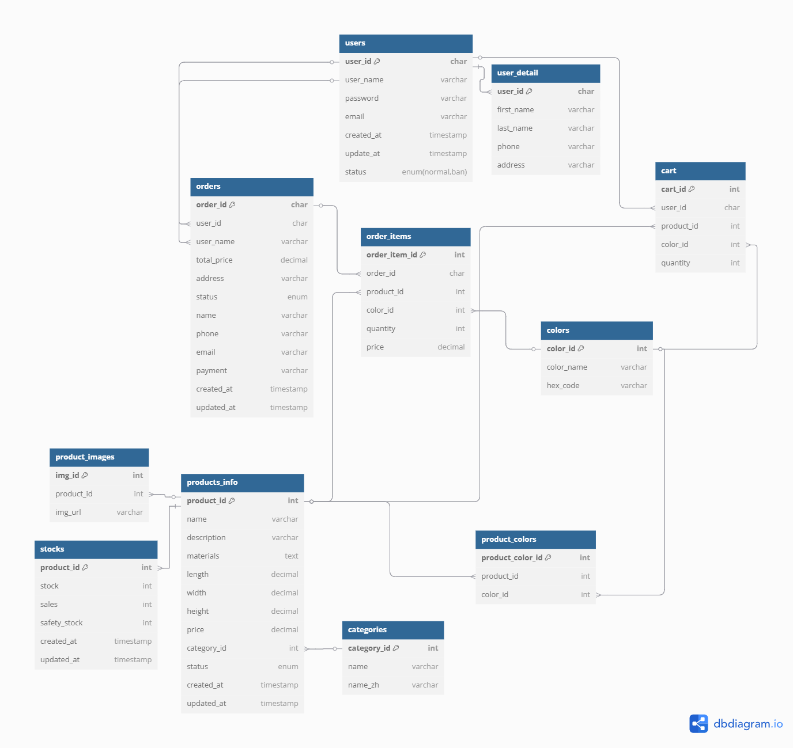

# 🛒 家家家具

這是一個簡易的電商網站前台，採用 **MVC**架構 和 **RESTful API**設計，前端使用 Vue 3 搭配 vite ，後端使用 Node.js + MySQL，包含 **RWD、登入、商品搜索、購物車** 等功能。

🛑 **目前僅支援本地開發，未部屬**
展示影片 : https://www.youtube.com/watch?v=Dk2tq0DuNGI

---

## 📊 資料庫架構

以下是本專案的 MySQL 資料庫設計：

---

## 🔹 主要功能

- **RWD(桌機 / 平板 / 手機)**
- **登入（token-based）**
- **商品搜索**
- **購物車**
- **成立訂單(無串金流 API)**

---

## 🛠️ 使用技術

- **前端**：Vue 3, vite, pinia
- **後端**：Node.js, Express, MySQL, Sequelize

---
